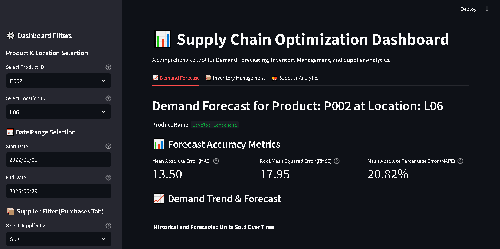

# Supply Chain Optimization Dashboard

## Project Overview

This project provides an interactive dashboard for optimizing supply chain operations. It covers Demand Forecasting, Inventory Management, and Supplier Analytics to help businesses make informed decisions regarding stock levels, future demand, and supplier performance.

The dashboard uses simulated data to demonstrate key functionalities.

## Key Features

* Demand Forecasting: Visualize historical demand and future predictions with accuracy metrics.
  
* 
  
* Inventory Management: Track current stock, calculate optimal safety stock, reorder points, and reorder quantities.
* Supplier Analytics: Monitor supplier performance, including on-time delivery rates and average lead times.
* Interactive Filters: Analyze data by product, location, supplier, and custom date ranges.

* 

## Technology Stack

* Python: Core programming language
* Pandas: Data manipulation
* Prophet: Time series forecasting
* Streamlit: Interactive web dashboard
* Plotly: Data visualization

## Maintainer

**Twinkle Devwanshi**
Supply Chain Analyst
Email: tdevwanshi96@gmail.com
LinkedIn: https://www.linkedin.com/in/twinkle-devwanshi/

### About the Developer
Twinkle is a Supply Chain Analyst with over 4 years of experience analyzing demand, inventory, and logistics data to improve operational performance. This project applies structured data analysis and forecasting methods to support inventory decisions, improve delivery performance, and enhance coordination across procurement and warehouse operations. Skilled in SQL and data visualization, Twinkle maintains this dashboard as a tool for evaluating forecast trends and tracking key supply chain metrics.